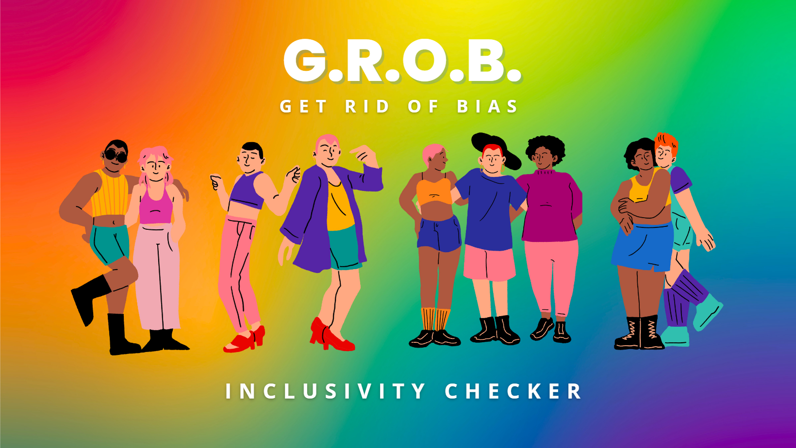

# TEAM: 🌈 Our P.R.I.D.E (Partnership Renders Incredible Developer Energy) 🥳

## **_Criteria_**

Following the topic of Pride Representation our team agreed on an idea suggested by @CallumDennisIE to create a tool that will support the removal of unconscious bias from written material. Although the different aspects of bias (e.g. sex, race, gender, age etc) is a huge area, we decided to keep our focus on addressing bias within the LGBTQ+ community.
We addressed the applicable criteria for this project by:

- ✨ Using the Materialise CSS framework to create a three-page website.
- ✨ Including other technologies such as HTML and JavaScript.
- ✨ Adding information to the README template.
- ✨ Using GitHub Project to plan, delegate tasks and execute the project.
- ✨ Completing and deploying the project on GitHub.

During our second get-together work was divided between the group with members putting themselves forward to tackle particular tasks.

## **_Intro_**

G.R.O.B (Get Rid Of Bias) is an innovative online tool created to help people and organisations looking to create inclusive content by removing any unconscious bias that may be present in their literature. With a particular focus on promoting inclusivity of the LGBTQ+ community G.R.O.B provides alternative words to replace any that may be regarded as bias within your material.

## **_Goal_**

**_Problem Statement:_**

The world has changed to support the idea that everyone has the right to feel valued and included. Words that have always been acceptable, e.g. A family raised by mum and dad, can now be seen as being non-inclusive. For many, knowing the right alternative words to use can be challenging so G.R.O.B provides insights into alternative inclusive words e.g. A family raised by parents.

**_Objectives:_**

- ✨ To create a tool that makes written language more inclusive for the LGBTQ+ community.
- ✨ To highlight where unconscious bias may exist within written material and provide an opportunity to replace that with a more inclusive term.
- ✨ Develop an intuitive tool that is easy for clients to use.

**_Target Audience:_**  
Business to consumer (free for non-commercial content)

Business to business (premium version for organisations)

**_Benefits:_**

Fosters inclusivity within the LGBTQ+ community.
Supports the idea that we all matter and have the right to be included.

## **_Tech_**

In the tech section, we provide information about the technology stack, dependencies, and any technical details related to the project.

- HTML5
- CSS3
- JavaScript
- Materialize
- TinyPNG
- Markdown
- Font Awesome
- Git and GitHub
- Codeanywhere
- VisualStudioCode

## **_Challenges_**

Our main challenge was in deciding how to create our database of words as we wanted to avoid using derogatory or negative terms during this challenge, so we focused on subjects that began or ended with the word ‘man’ e.g. manhunt > pursuit and also family related terms e.g. brother/sister > sibling.

Another big challenge, as we all are quite junior developers without real team work experience in this specific matter, has been to all work together on the same project. Participating all remotely and being all new co-workers made the challenge even bigger. But we have learnt some good practices and grew a lot with this amazing challenge.

Unfortunately Diane was unable to push changes to the website due to vscode and codeanywhere challenges so her contributions focused on content and images.

## **_Future Updates_**

Future updates of G.R.O.B include expanding its reach so that other biases are included e.g., racism, sexism, ageism, and gender equality.

## **_Deployment_**

GitHub Repository URL: https://github.com/yannickferenczi/grob

Live Site : https://yannickferenczi.github.io/grob/

## **_Credits_**

We would like to give credit to the Our PRIDE team

- 🙌 [Callum @callumDennisIE] ✨ Team Leader

 "Callum naturally took the lead of the team as he was the most hackathon experienced and also because he brought this amazing inclusivity checker idea. He has been a real help on using Git and GitHub and especially when it came to merge conflicts. He has been a great pleasure to take this challenge beside him."

- 🙌 [Diane @todiane]

 "Despite Diane only just starting the course and never having taken part in a Hackathon, she was very willing to contribute. Diane proved instrumental in providing suggestions and amazing images that tied together the whole project."

- 🙌 [Dylan @Dylangroome]
- 🙌 [Nate @Redsskull]

 ""Nate has been a prominent and active member of the team. His experience and knowledge of coding has meant he has been able to actively support all areas of the project and his fellow team members."

- 🙌 [Yannick @yannickferenczi] ✨ Scrum Lead

 "Yannick's role as our scrum leader has been nothing short of amazing. His constant presence (day and night) meant work got done, quickly and    efficiently. I have no doubt that the way he managed this whole project lead to its successful completion."

along with following individuals, organizations, and resources that have contributed to the project or provided inspiration:

- ✨ [Alissa Troiano] ✨ Hackteam Manager
- 🌐 the FAQ content was researched by Nate and some of it's content was generated and found using ChatGPT.
- 🌐 [External Resource 2]

